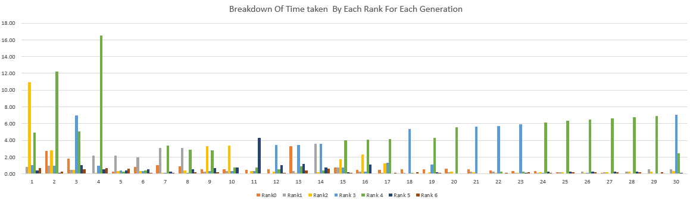
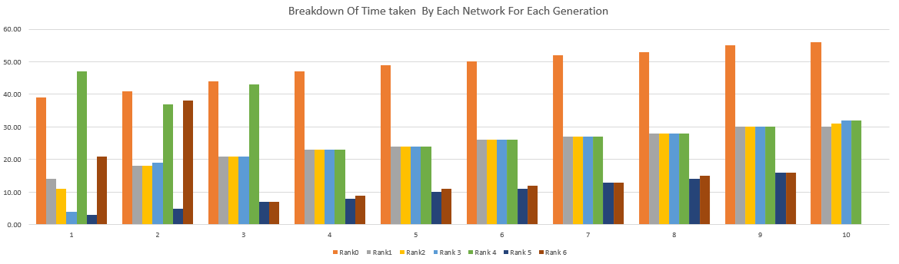
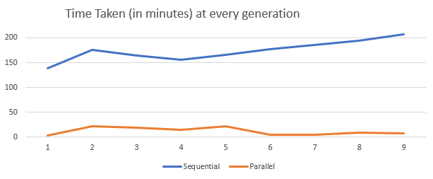

# ParallelGeneticsInspiredNeuralNetworkTuning

## Introduction:

The first analysis for optimizing neural network is shown [here](https://github.com/bhatnags/GeneticsInspiredNeuralNetworkTuning
). Keeping the search space and coding methodology same, the tuning of neural networks using genetic algorithm has been parallelized using Mpi4py. For that two models are considered: 
* multiple deme fine grained genetic algorithm model
* hybrid multiple deme fine grained genetic algorithm (multiple deme model built on top of multiple demem model) - Island model

Thanks to the research paper [here](https://www.researchgate.net/publication/2362670_A_Survey_of_Parallel_Genetic_Algorithms)

# multiple deme fine grained genetic algorithm model
The same is run using multiple processors. Every processor initiates one network. For crossover, network of the provious rank is taken. The bred child is mutated considering 2% mutation chance. In this analysis, multiple codes are run using 3, 5, 7, 14, 21, 35 processors.

# Island Model
Island model uses the same concept as stated above. However, multiples island are initalised with population in each island. Two types of breeding takes place, inter-island(after every 10 generations) and intra-island. Two codes are run as below:
* population size of 3 in each island, using 7 processors
* population size of 7 in each island, using 21 processors

## Requirements:

1. Server: Scientific Linux release 7.5 (Nitrogen)
2. conda 4.5.10
3. Python 2.7.15 :: Anaconda, Inc.
4. numpy 1.15.0
5. Keras 2.2.2
6. Tensorflow 1.5
7. gcc: gcc (GCC) 4.8.5 20150623 (Red Hat 4.8.5-28)
8. ld: ldd (GNU libc) 2.17
9. Mpi4py 2.0.0

## Usage:
    mpiexec -n 7 python dnnt.py
    mpiexec -n 7 python innts.py
This saves the output in log files. The code can be run in accordance with the availability of cluster nodes

## Analysis

Starting with analysis on code using 7 networks initialized on 7 processors in parallel. The below image shows that time taken at each processor is different. This is because the initalized networks and immediately bred networks have higher hyper-paramenter dimensions(e.g. 1024 nodes) and thus take more time. However, towards the end the time taken turns out to be same for all the network, this is due to the fact that later networks take similar set of hyper-parameters (sgd optimizer + 3 or 9 layers + sigmoid activation function + 9 layers + 256 nodes). 

Due to lower mutation chance, the parameters stay the same over generations, thus keeping the fitness same. Comparing the same with serial code as shown in figure below, it can be easily concluded that time taken to train each network in parallel is less than the time taken while training in sequential. The reason behind such behavior is division and ease of access of RAM for each network. Keras add session everytime a model is trained.

The reduction of time at generation level is due to division of tasks in parallel reducing the amount of time taken as per "Law of division of labor", which can be seen below.

Furthermore, an analysis on efficiency and speedups show the below:

| Network  | Sequential Time | Parallel Time  | Speedup | Efficiency  |
| ------------- | ------------- | ------------- | ------------- | ------------- |
| 7  | 139  | 3  | 46.3  | 6.62 |
| 70  | 262  | 29  | 9  | 0.13  |

